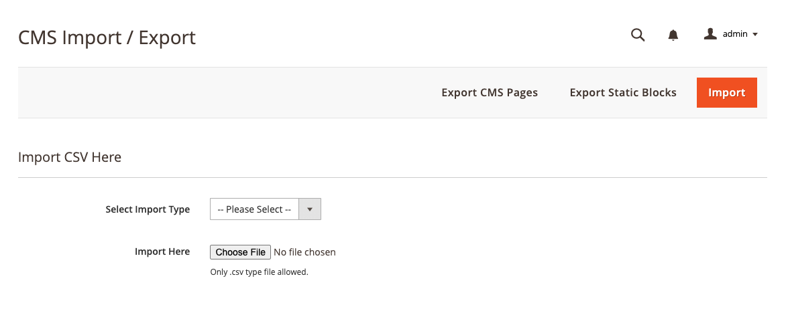

<strong>JD_CmsImporter</strong> 

## Table of contents

- [Summary](#summary)
- [Installation](#installation)
- [Configurations](#configurations)

## Summary

Module is used to import or export CMS Blocks and Pages.

## Installation

```
Upload into app/code/Piranha

bin/magento module:enable Piranha_CmsImporter
```

## Configurations

```
1. Login to Magento Backend
2. Navigate to Content > Elements > Import/Export
```


